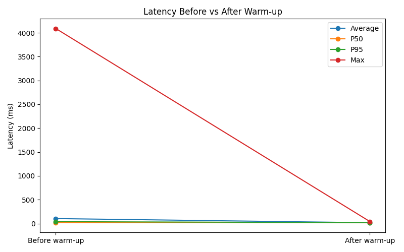
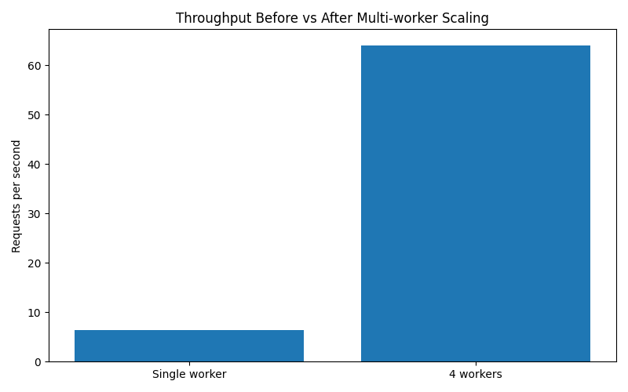
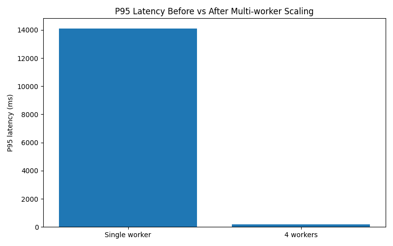
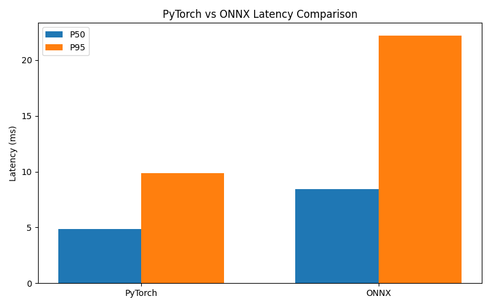
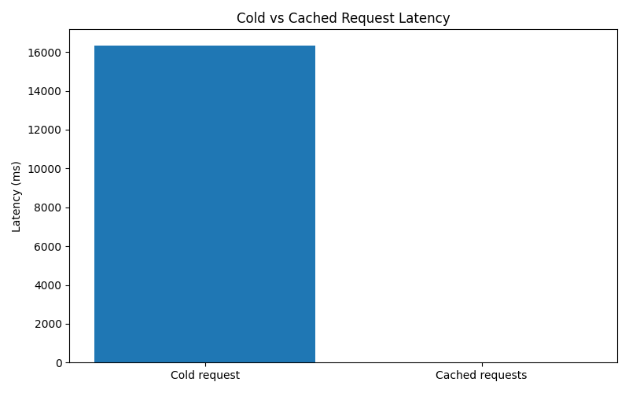

# 🚀 ML Inference Optimization System

A production-style ML inference system designed to benchmark and optimize embedding generation performance using batching, caching, multi-worker scaling, and ONNX Runtime.

---

## 📌 Overview

This project explores how to **systematically improve ML inference performance** in a real-world serving environment.

Starting from a baseline FastAPI service, the system was incrementally optimized through:
- system-level improvements (workers, batching, caching)
- runtime-level optimization (ONNX)
- empirical benchmarking and analysis

The goal is not just implementation, but **measuring trade-offs and validating performance gains**.

---

## ⚙️ Tech Stack

- FastAPI – inference API server  
- Sentence Transformers (PyTorch) – baseline model  
- ONNX Runtime – optimized inference backend  
- Python – core implementation  
- Uvicorn – ASGI server  

---

## 🧪 Features

### 1. Baseline Inference API
- REST endpoint for text embeddings
- Measures latency per request

### 2. Multi-Worker Scaling
- Improved throughput using parallel workers
- Reduced bottlenecks under concurrent load

### 3. Batching
- Processes multiple inputs in a single forward pass
- Reduces per-request overhead

### 4. Caching
- In-memory cache for repeated inputs
- Eliminates redundant computation
- Achieves ~4–5 ms latency for repeated queries

### 5. ONNX Runtime Integration
- Exported model to ONNX format
- Added alternative inference path for comparison
- Evaluated runtime trade-offs vs PyTorch

---

## 📊 Performance Highlights

### 🔹 Throughput
- Increased from ~6.4 → 64.1 req/s (multi-worker)

### 🔹 Latency Improvements
- Cold start reduced from ~4s → ~42ms  
- Cached requests reduced to ~4–5 ms  

### 🔹 PyTorch vs ONNX

| Metric       | PyTorch | ONNX |
|-------------|--------|------|
| P50 latency | ~4.87 ms | ~8.43 ms |
| P95 latency | ~9.89 ms | ~22.22 ms |
| Max latency | ~4317 ms | ~330 ms |

### Key Insight
- PyTorch is faster in steady-state inference  
- ONNX provides more stable initialization behavior  

---

## 📈 Performance Visualizations

### Warm-up Optimization

### Multi-worker Throughput

### Multi-worker P95 Latency

### PyTorch vs ONNX

### Cold vs Cached Request

## 🧠 Key Learnings

- Performance optimization must be **measured, not assumed**
- System-level optimizations (batching, caching) often outperform model-level changes
- ONNX is not always faster — results depend on the serving setup
- Cold-start latency can dominate real-world performance

---

## 🏗️ Project Structure

InferenceBench/
├── app/ # API + services
├── models/ # model loading + ONNX export
├── scripts/ # benchmark scripts
├── experiments/ # analysis results
├── requirements.txt
└── README.md

---

## 🚀 Getting Started

### 1. Install dependencies

pip install -r requirements.txt

### 2. Run server

python -m uvicorn app.main:app

### 3. Open API docs

http://127.0.0.1:8000/docs

---

## 🧪 Running Benchmarks

### PyTorch vs ONNX

python scripts/onnx_benchmark.py

### Cache performance

python scripts/cache_benchmark.py

---

## 📦 ONNX Model Setup

The ONNX model is not stored in the repo due to size.

Generate it locally:

python models/export_onnx.py

---

## Limitations

- In-memory caching does not work across multiple workers
- ONNX was not faster than warm PyTorch in this local CPU setup
- The system is local only and not yet deployed to distributed infrastructure
- The ONNX model must be generated locally because large model files are not stored in the repo

## 📈 Future Improvements

- Redis-based distributed caching  
- GPU inference support  
- autoscaling deployment (Docker / Kubernetes)  
- advanced request scheduling  

---

## 🎯 Summary

This project demonstrates a **full ML systems optimization workflow**, from baseline implementation to advanced performance tuning and evaluation.

It highlights the importance of:
- benchmarking  
- system design  
- real-world trade-offs in ML deployment  